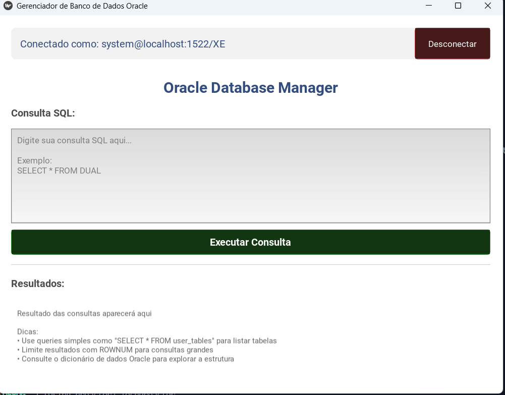

## POC - App Desktop Kivy

Nesse projeto estou realizando uma POC para testar a criação de uma aplicação Kivy para gerenciamento de banco de dados Oracle. Os seguintes pontos serão abordados:

- Receber via parâmetros dados de conexão como usuário, host e senha do banco de dados
- Conectar a um banco de dados Oracle com essas credenciais
- Fazer uma consulta qualquer e exibir os dados
- Gerar um executável que não precise de instalação

---

### Telas da aplicação

#### Login


#### Execução das queries



---

### Etapas para executar

> Necessário ter o [python3](https://www.python.org/downloads/)

##### Criar e ativar ambiente virtual

```bash
python3 -m venv venv
source venv/bin/activate # linux
venv\Scripts\activate # windows
```

##### Instalar dependências

```bash
 pip install -r requirements.txt
```

<details>
  <summary>Ambiente Windows</summary>

##### Rodar o aplicativo

```bash
python main.py
```

---

##### Criando arquivo de execução do app

```bash
./build.bat # arquivo criado para automatizar o processo
```

</details>

<br/>

<details>
  <summary>Ambiente Linux</summary>

##### Rodar o aplicativo

```bash
python3 main.py
```

##### Rodar o banco de testes caso não tenha

```bash
 docker run -d \
 --name oracle-free \
 -p 1521:1521 \
 -e ORACLE_PASSWORD=MinhaSenh@123 \
 -v oracle-data:/opt/oracle/oradata \
 gvenzl/oracle-free:23-slim
```

##### Informações de conexão

- Usuário: system
- Senha: MinhaSenh@123
- Host: localhost:1521/FREE

---

##### Criando arquivo de execução do app

```bash
pthon3 build.py # arquivo criado para automatizar o processo
```

##### Caso queira apagar o banco

```bash
docker stop oracle-free
docker rm oracle-free
docker volume rm oracle-data
```

---

#### Erros comuns

##### Caso apareça o error "MTDev is not supported by your version of linux"

```bash
sudo apt-get install libmtdev-dev
```

##### Caso apareça o error "Unable to find any valuable Cutbuffer provider."

```bash
sudo apt-get install xclip xsel
```

</details>
